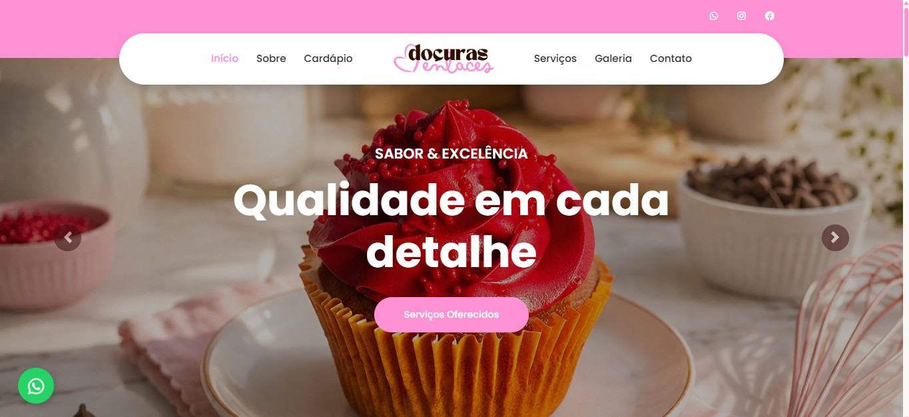
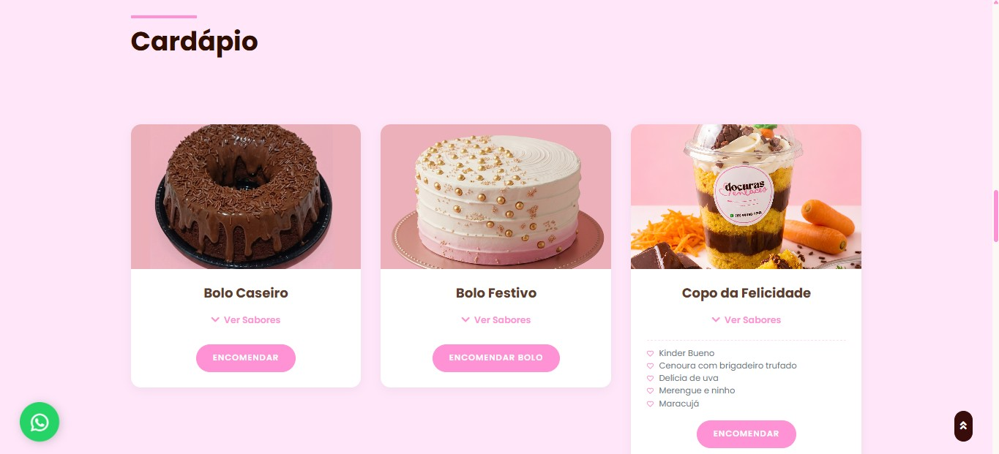
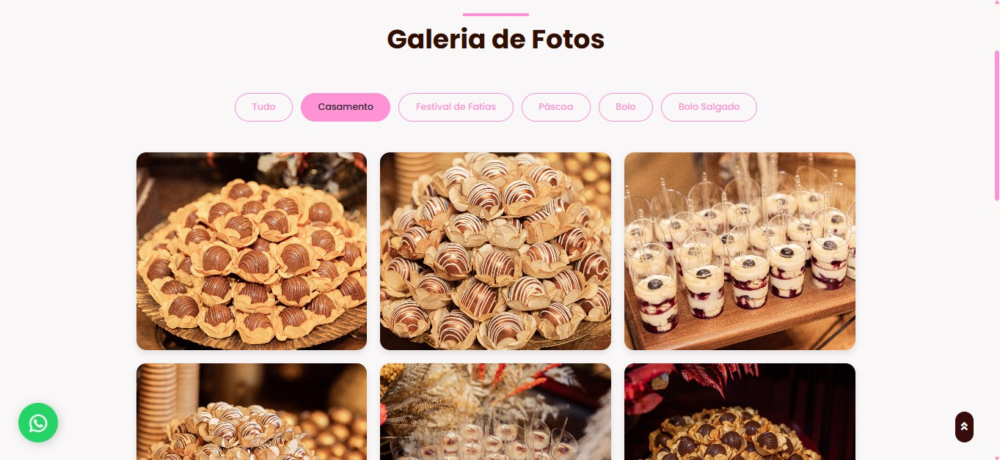
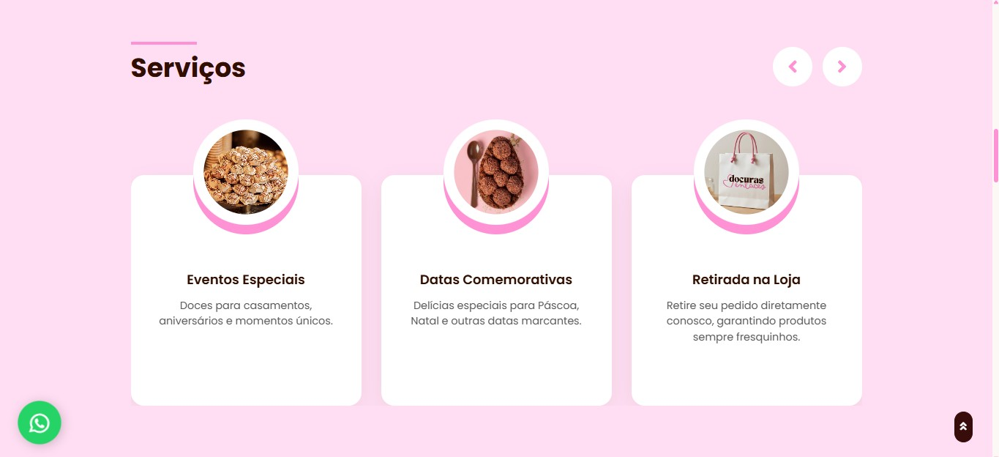

# 🧁 `Doçuras Enlaces: Catálogo Digital e Presença Online (WEB)`


>  Este é um projeto comercial real, desenvolvido para validar a presença digital e otimizar o fluxo de vendas da doceria artesanal *Doçuras Enlaces*. Atualmente, o repositório serve também como objeto de estudo contínuo para refatoração e aplicação de boas práticas de engenharia de software frontend.

Este repositório contém o código-fonte da Plataforma Web oficial da Doçuras Enlaces. Desenvolvida focando em alta conversão e experiência do usuário (UX), a interface substitui o atendimento informal por um catálogo visual e um fluxo automatizado de pedidos, conectando diretamente a necessidade do cliente final à mensageria do negócio.

---

## 💡 `Sobre a Plataforma`

A plataforma da Doçuras Enlaces foi projetada para estabelecer a presença digital da marca com rigor técnico e estética refinada. O sistema substitui processos de consulta informais por uma interface estruturada que oferece:

* **Exposição de Ativos:** Catálogo de alta performance com filtragem dinâmica por categorias.
* **Fluxo de Atendimento:** Integração de formulários com tratamento de dados e despacho via e-mail corporativo.

A implementação garante uma jornada de usuário fluida, desde a visualização dos produtos até a finalização da solicitação de orçamento.

---

## 💻 `Telas Principais`

| Início | Catálogo |
| :---: | :---: |
|  |  | 

| Galeria | Serviços |
| :---: | :---: |
|  |  | 

---

## 🛠️ `Tecnologias e Conceitos Aplicados`

| Segmento | Stack Tecnológica | Bibliotecas, APIs e Conceitos |
| :--- | :--- | :--- |
| **Interface Web** | HTML5, CSS3, JavaScript (ES6) | Bootstrap 4.5, jQuery, Arquitetura Responsiva (Mobile-First) |
| **Integrações** | EmailJS API, WhatsApp API | Google Maps Platform, Font Awesome |
| **Manipulação de Dados** | JavaScript Assíncrono | Isotope (Filtros dinâmicos), Tratamento de Strings e Manipulação do DOM |

---

## 📁 `Estrutura do Repositório`

```text
docuras-enlaces/
├── css/
│   └── style.css          # Estilização global, variáveis de cor e responsividade
├── img/
│   ├── logo-docuras.png   # Ativos de identidade visual
│   └── [assets-galeria]   # Repositório de imagens otimizadas dos produtos
├── js/
│   ├── cardapio.js        # Objeto de dados (JSON-like) contendo os produtos e sabores
│   ├── render.js          # Script de controle, injeção de componentes e lógica do modal do WhatsApp
│   ├── galeria.js         # Lógica de controle do Isotope e renderização assíncrona do portfólio
│   └── main.js            # Inicialização de dependências globais e eventos de navegação
├── lib/                   # Dependências e plugins locais (OwlCarousel, Isotope, Lightbox)
├── index.html             # View principal (Landing Page, Sobre, Seção Cardápio)
├── galeria.html           # View de portfólio completo com filtros por categoria
└── contato.html           # View de conversão com formulário e mapa de localização